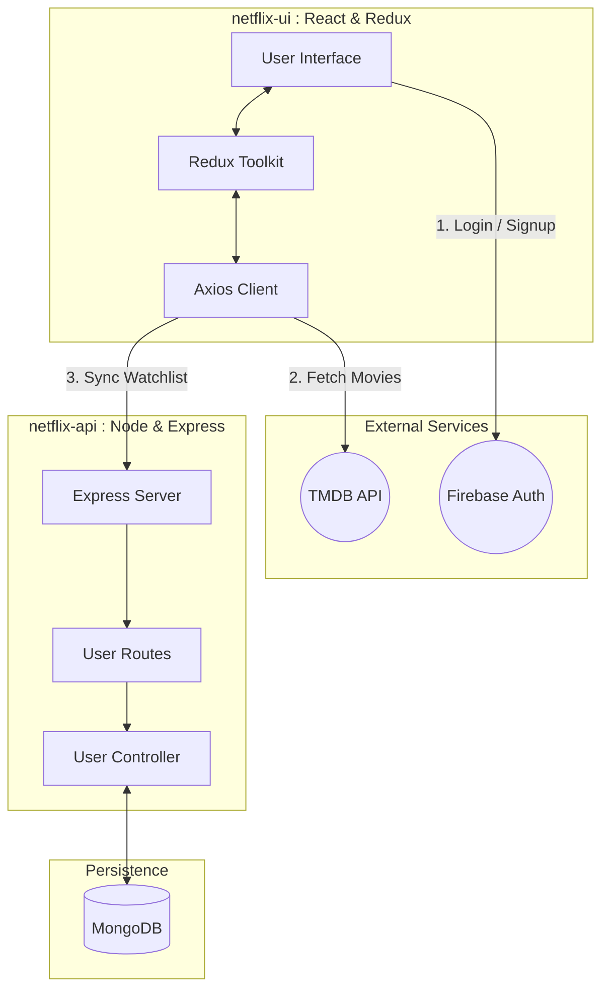

# 🎬 Netflix Clone

A full-stack Netflix clone application built with **React** on the frontend and **Node.js / Express** on the backend. The app supports user authentication, movie browsing via TMDB, trailer playback, and personalized watchlists, all wrapped in a responsive Netflix-style UI.

---

## 🏗️ System Architecture



---

## ✨ Features

* 🔐 **User Authentication**
  Secure signup and login using Firebase Authentication.

* 🎥 **Movie Browsing**
  Browse movies by categories such as Netflix Originals, Trending, and Top Rated.

* ▶️ **Video Trailers**
  Watch movie trailers directly within the app.

* 📌 **Personal Watchlist**
  Add and manage movies in a personalized watchlist stored in MongoDB.

* 📱 **Responsive Design**
  Optimized for desktop, tablet, and mobile devices.

* ⚡ **Real-time UI Updates**
  Dynamic content loading using Redux Toolkit and Axios.

---

## 🧰 Tech Stack

### Frontend

* React 18
* Redux Toolkit (state management)
* Styled Components
* Axios
* Firebase Authentication
* React Router
* React Icons

### Backend

* Node.js
* Express.js
* MongoDB & Mongoose
* CORS
* Nodemon (development)

---

## 📋 Prerequisites

Make sure you have the following installed:

* **Node.js** v18 or higher (LTS recommended)
* **MongoDB** (local installation or Docker)
* **npm** or **yarn**

---

## 🚀 Installation & Setup

### 1️⃣ Clone the Repository

```bash
git clone <repository-url>
cd netflix-clone
```


### 2️⃣ Install Dependencies

```bash
npm install
```

### 3️⃣ Environment Variables

Create a `.env` file and configure the following:

```env
TMDB_API_KEY=your_tmdb_api_key
FIREBASE_API_KEY=your_firebase_api_key
MONGO_URI=your_mongodb_connection_string
```

---

## ▶️ Running the Application

### Development Mode

```bash
npm run dev
```

### Production Mode

```bash
npm start
```

---

## 🌐 Access the App

Open your browser and navigate to:

* **Frontend:**
  `http://localhost:3000/`

* **Backend API:**
  `http://localhost:8000/`

---

### Screenshots


---

## 🛠 Languages & Frameworks Used

* JavaScript (ES6+)
* React
* Node.js
* Express
* MongoDB

---

## 📌 Future Improvements

* User profiles and avatars
* Movie recommendations
* Search functionality
* Improved caching & performance
* CI/CD pipeline with Docker and GitHub Actions

---

## 📄 License

This project is for **educational purposes only** and is not affiliated with Netflix.

---

👤 Author Information 
Name: Anthony Usoro 
Slack Username: @anthonyusoro 
Project: Netflix Clone.

---